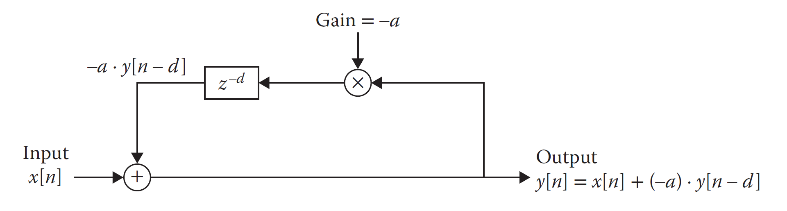
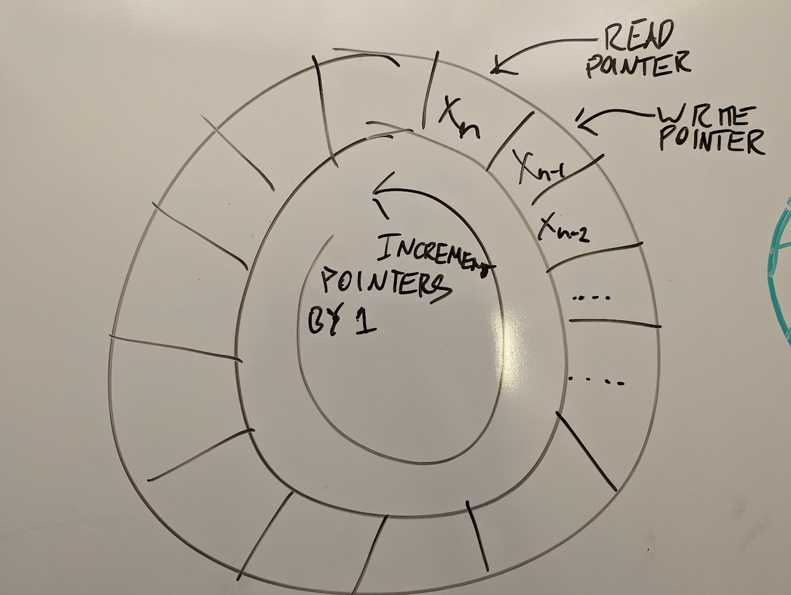
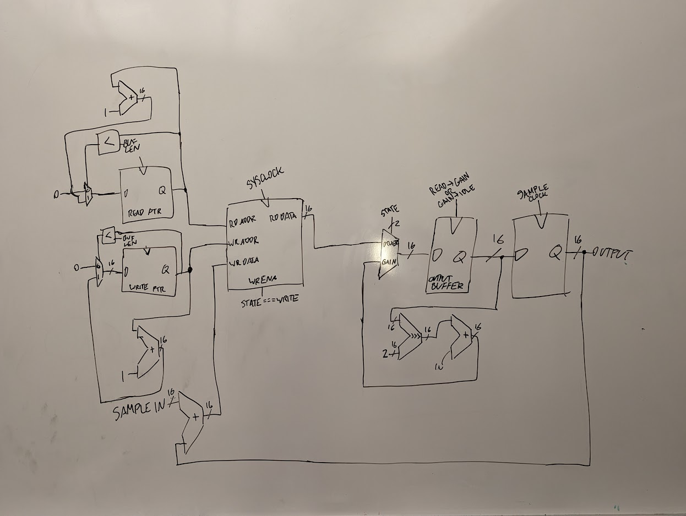
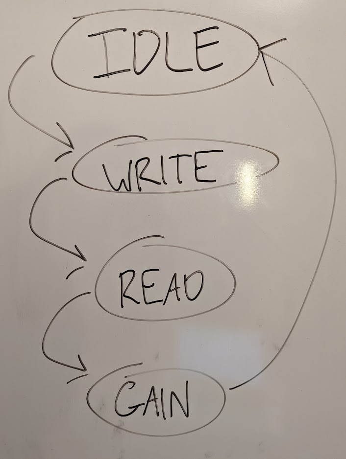

# Overview

This project is a feedback audio delay effect. It uses a circular buffer to store incoming 16-bit audio samples and repeat them back out with a gain smaller than 1 applied to them.

Diagram of feedback audio delay from *Hack Audio* by Eric Tarr

My implementation of feedback delay only works in simulation right now, so it's fairly simple. As a stretch goal, I was going to make it work with real audio input and output using the [Pmod I2S2](https://digilent.com/shop/pmod-i2s2-stereo-audio-input-and-output/), but I didn't have time. Part of that stretch goal also involved using the SRAM chip on the [Digilent Cmod A7 boards](https://digilent.com/reference/programmable-logic/cmod-a7/reference-manual) used in class to store the circular buffer. I did not simulate the SRAM interface — I just use the block ram module from class.

# My Implementation

The two main parts of this project are the circular buffer and the finite state machine that interacts with it. For this simulation-only implementation, my testbench clocks 16-bit samples stored in a `.memh` file into an input of my main module. I clock samples into the module at a rate of 44100 samples/second (the sample clock). There is also a faster system clock that runs the buffer and FSM. To make sure the output is sent at the correct sample rate (44.1kHz), I use two registers. One of them is connected as the actual signal output. The other one stores the next output and only transfers it to the signal register on the rising edge of the sample clock.

## Circular Buffer

Above is a diagram of a circular buffer. For it to work, there is a read pointer and a write pointer. The buffer has some amount of length — when the read or write pointer reaches the end of the buffer, it resets back to the start. The read pointer is always 1 address ahead of the write pointer. As data is clocked into the buffer, the data at the read pointer is read from the buffer, some other data is written at the write pointer, and then both pointers increment by 1. Eventually, the read pointer is reading data that from a location written to by the write pointer earlier.

For an alternate explanation, see the [Wikipedia page](https://en.wikipedia.org/wiki/Circular_buffer).

By reading and writing audio samples to/from this buffer, you can create a delay effect.

### Implementation

Above is a simplified schematic of my project. For clarity, it isn't optimized. 

For my circular buffer, I use the block ram module from the labs in class. I store the read and write pointers in their own registers (you could also use one register and combinational logic on the output since the pointers are always a fixed distance from each other). I also store the buffer length as a constant (this would not be good for practical use). Decreasing the length of the buffer decreases the length of delay. The opposite is also true. Before reading or writing the buffer, I check if the pointer has reached the end (if it's greater than or equal to the value in the buffer length register) — if it is, it is reset to 0 (the "start" of the buffer). If it isn't, it is incremented by 1. The specifics beyond this are better explained in the context of the FSM.

## Finite State Machine

Above is a diagram of my FSM. It transitions from the `idle` state on the positive edge of the sample clock. The rest of the state transitions happen on the positive edge of the system clock.

### Write

During the write state, the input sample and the output are added together and written to the buffer at the write pointer on the next rising clock edge. The write pointer is either incremented or reset to 0 if it reached the end of the buffer.

### Read

During the read state, the read pointer is either incremented or reset to 0 if it reached the end of the buffer. The data at the read pointer is written to the output buffer on the next rising clock edge.

### Gain

During the gain state, the output buffer's value is arithmetic right shifted by 2, essentially applying a gain of 0.25, and added to the input sample. This is the feedback part of the feedback delay.

# Simulation results

Here is an image of the waves from a simulation. The input signal stored in a `.memh` file (generated using a Python script) is 50ms of silence followed by 50ms of a 440Hz sine wave with an amplitude of 8192, followed by 900ms of silence. The signal is generated with a 44.1kHz sample rate.
